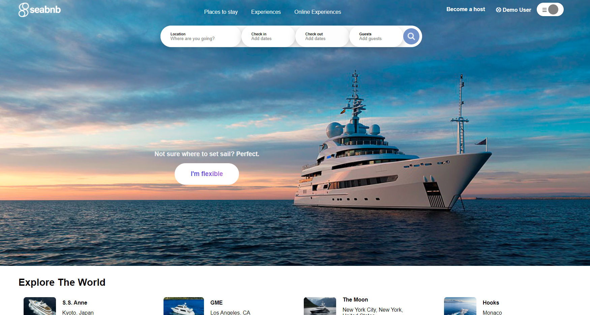
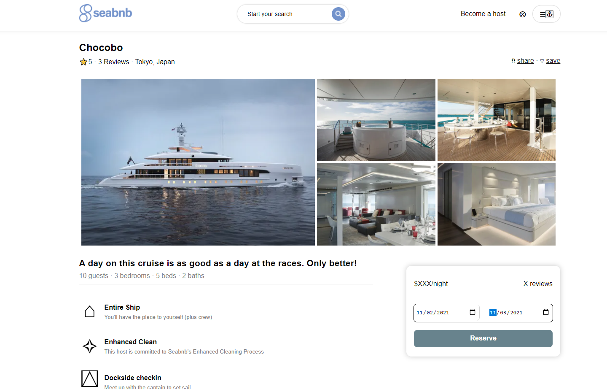
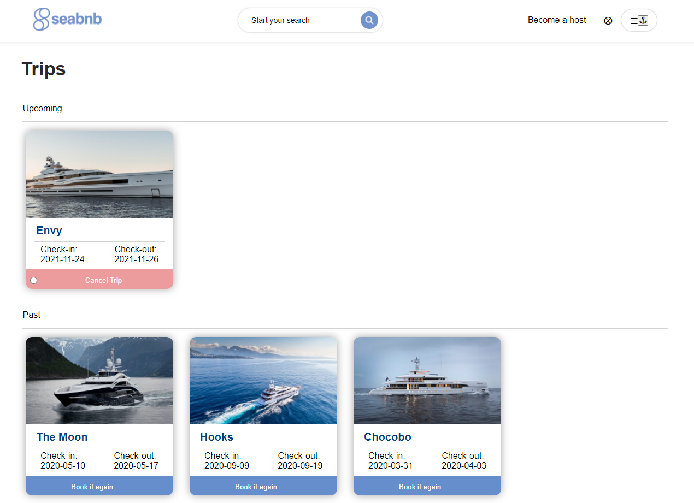

# [SeaBnb](https://sea-bnb.herokuapp.com/)
Spun off of [Airbnb](https://wwww.airbnb.com), this clone focused on catering to yacht owners looking for a new revenue stream from one of their high-value assets

Contents:
 1. Overview
 2. Functionality
 3. Backend Summary
 4. FrontEnd Summary
 
### Overview

Seabnb is a travel website that enables users to make reservations on the worlds most beautiful, privately owned yachts. Once they have completed their stay, users can review how much they enjoyed the spot, and book it again if they like.

### Using Hurton
SeaBnb style and use are very similar to Airbnb. The look and feel should be immediately familiar to anyone who has used the latter. You can browse the splash page to see some possible locations, or check the reservation possibilities using the 'Im Flexible' button that is front and center. 

### Backend
The backend's API is built using Express and Sequelize

---

### Frontend

---
### Going Forward

Next steps for this project are:
 - Fix the minor react bugs that are present during state changes
 - Add ability of users to create their own spots that they could list.
 - Include more dynamic data on spots such as price and rating.
 - Add a functional searchbar
